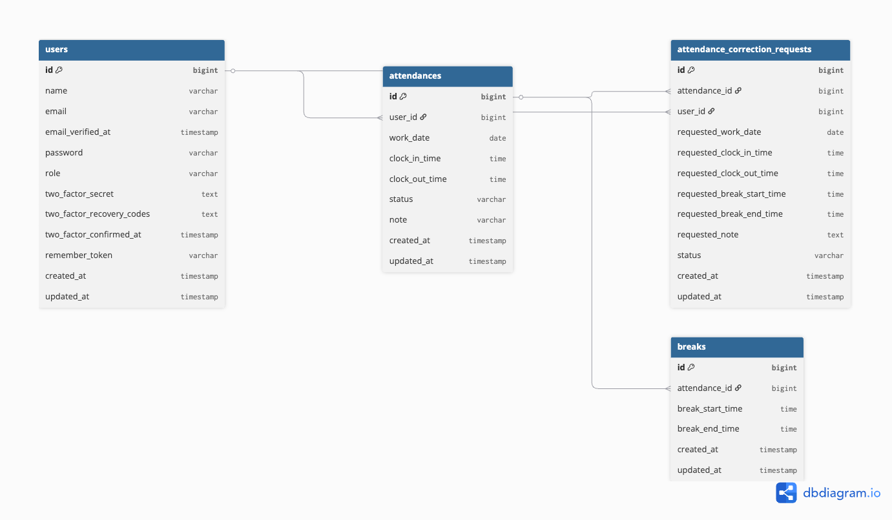

# 勤怠管理アプリ

## 概要

本アプリは、**出勤・退勤・休憩管理** を行う勤怠管理アプリケーションです。  
ユーザーは **会員登録** を行った後、**メール認証** を完了しないとログインおよび勤怠機能を利用できません。  
また、ユーザーの操作（出勤、退勤、休憩開始など）を、管理者が承認・確認できる機能を実装しています。

---

## 使用技術

- Laravel Framework（^10.0）
- PHP 8.4
- MySQL 8.0
- Docker
- Nginx
- Laravel Fortify（認証機能）
- Mailhog（開発用メール確認ツール）

---

## 環境構築

以下の手順を上から順番に実行してください。

---

### 1. GitHubリポジトリをクローン

```bash
git clone https://github.com/nonkey826/attendance-fortify.git
cd attendance-fortify
````

---

### 2. Dockerの起動

Dockerコンテナを起動します。
（PHP / MySQL / Nginx / Mailhog などが同時に立ち上がります）

```bash
docker compose up -d
```

---

### 3. 依存関係のインストール

Laravelプロジェクトに必要なパッケージをインストールします。
※ PHPコンテナ内で実行されます

```bash
docker compose exec php composer install
```

---

### 4. 環境ファイルの設定

`.env.example` をコピーして `.env` を作成します。
コピー後、.env ファイルの以下の項目を確認・必要に応じて修正してください。

```bash
cp .env.example .env
```

---

#### データベース設定

```env
DB_CONNECTION=mysql
DB_HOST=mysql
DB_PORT=3306
DB_DATABASE=laravel_db
DB_USERNAME=laravel_user
DB_PASSWORD=laravel_pass
```

---

#### メール設定（Mailhog）

```env
MAIL_MAILER=smtp
MAIL_HOST=mailhog
MAIL_PORT=1025
MAIL_USERNAME=null
MAIL_PASSWORD=null
MAIL_ENCRYPTION=null
MAIL_FROM_ADDRESS="hello@example.com"
MAIL_FROM_NAME="${APP_NAME}"
```

---

### 5. アプリケーションキーの生成

```bash
docker compose exec php php artisan key:generate
```

---

### 6. マイグレーションとダミーデータ投入

データベースのテーブル作成と初期データの投入を行います。

```bash
docker compose exec php php artisan migrate --seed
```

このコマンドで以下のデータが作成されます：

* 管理者ユーザー
* 一般ユーザー
* 勤怠データ

---

## MySQL接続（必要な場合のみ）

```bash
docker compose exec php mysql -h mysql -u laravel_user -p"laravel_pass" --skip-ssl
```

---

## アクセスURL

* アプリ：[http://localhost](http://localhost)
* Mailhog：[http://localhost:8025](http://localhost:8025)
* phpMyAdmin：[http://localhost:8085](http://localhost:8085)

---

## ログイン情報

### 管理者

* メール：[admintest@test.com](mailto:admintest@test.com)
* パスワード：password

### 一般ユーザー

* メール：[user@test.com](mailto:user@test.com)
* パスワード：12345678


---

## メール認証機能

### 実装内容

* 新規会員登録時に認証メールを送信します。
* メール未認証ユーザーはログイン後もアプリ機能を利用できません。
* `verified` ミドルウェアにより、メール認証状態を制御します。
* `MustVerifyEmail` を Userモデル に実装。
* `email_verified_at` カラムにより認証状態を管理します。

### 開発環境でのメール確認方法

1. Mailhog にアクセス：[http://localhost:8025](http://localhost:8025)
2. 受信メール一覧から 認証メール を選択します。
3. メール内の 認証リンクをクリックします。
4. 認証完了後、勤怠画面 に遷移します。

---

## 機能一覧

### 一般ユーザー

* 会員登録
* ログイン / ログアウト
* メール認証機能
* 出勤処理
* 退勤処理
* 休憩開始 / 終了
* 勤怠一覧表示
* 勤怠詳細表示
* 修正申請

### 管理者

* 勤怠一覧表示
* 勤怠詳細・編集
* 修正申請の承認

---

## データベース設計


### **usersテーブル**

| カラム名                        | 型                    |
| --------------------------- | -------------------- |
| id                          | unsigned bigint      |
| name                        | varchar(255)         |
| email                       | varchar(255)         |
| email_verified_at           | timestamp (nullable) |
| password                    | varchar(255)         |
| role                        | varchar(50)          |
| two_factor_secret           | text (nullable)      |
| two_factor_recovery_codes   | text (nullable)      |
| two_factor_confirmed_at     | timestamp (nullable) |
| remember_token              | varchar(100)         |
| created_at                  | timestamp            |
| updated_at                  | timestamp            |

### **attendancesテーブル**

| カラム名           | 型               | 制約          |
| -------------- | --------------- | ----------- |
| id             | unsigned bigint | 主キー         |
| user_id        | unsigned bigint | 外部キー(users) |
| work_date      | date            |             |
| clock_in_time  | time            |             |
| clock_out_time | time            |             |
| status         | varchar(50)     |             |
| note           | varchar(255)    |             |
| created_at     | timestamp       |             |
| updated_at     | timestamp       |             |

### attendance_correction_requestsテーブル

| カラム名                     | 型               |
| ------------------------ | --------------- |
| id                       | unsigned bigint |
| attendance_id            | unsigned bigint |
| user_id                  | unsigned bigint |
| requested_work_date      | date            |
| requested_clock_in_time  | time            |
| requested_clock_out_time | time            |
| requested_break_start_time | time          |
| requested_break_end_time | time            |
| requested_note           | text            |
| status                   | varchar(50)     |
| created_at               | timestamp       |
| updated_at               | timestamp       |

### **breaksテーブル**

| カラム名             | 型               | 制約                |
| ---------------- | --------------- | ----------------- |
| id               | unsigned bigint | 主キー               |
| attendance_id    | unsigned bigint | 外部キー(attendances) |
| break_start_time | time            |                   |
| break_end_time   | time            |                   |
| created_at       | timestamp       |                   |
| updated_at       | timestamp       |                   |


---

## ER図



---

## 補足

* 本アプリでは、開発環境に Mailhogを使用しています。
  本番環境では、**SMTPサーバー**（例：SendGrid、Mailgunなど）を使用することで、実際のメール送信が可能です。

---

テスト実行手順（Docker環境）
1. 依存関係のインストール

まず、プロジェクトに必要な依存関係をインストールします。以下のコマンドを実行してください：
```bash
docker-compose exec php composer install
```
これにより、プロジェクトに必要なすべてのパッケージがインストールされます。

2. テスト実行の前提

Docker 環境では、テストを実行するために PHP がコンテナ内で動作することが重要です。php artisan test が コンテナ内で実行 されることを確認してください。

Docker コンテナ内に入って実行する
```bash
docker-compose exec php php artisan test
```
もしこれで動かない場合は、PHPUnit を使って実行
```bash
docker-compose exec php vendor/bin/phpunit
```