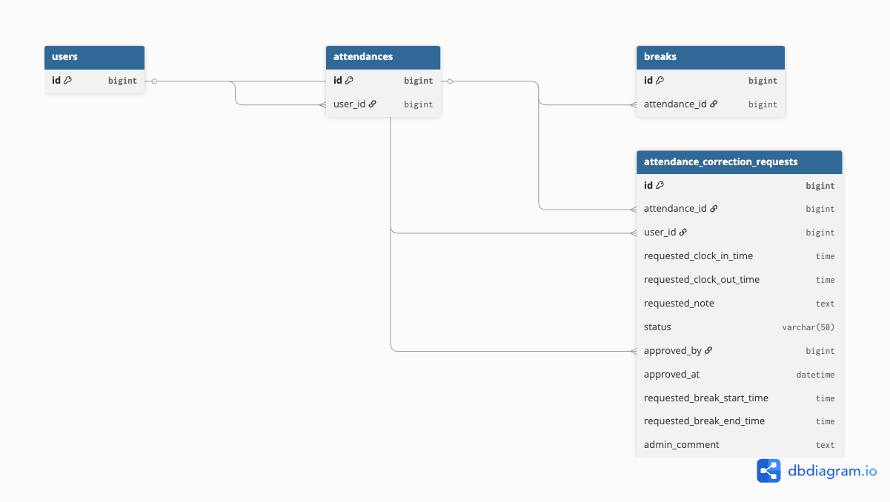

# 勤怠管理アプリ

## 概要

本アプリは、**出勤・退勤・休憩管理** を行う勤怠管理アプリケーションです。
ユーザーは **会員登録** を行った後、**メール認証** を完了しないとログインおよび勤怠機能を利用できません。
また、アプリケーション内でユーザーが実施する操作（出勤、退勤、休憩開始など）を管理者が承認・確認できる機能も実装されています。

---

## 使用技術

本アプリは以下の技術を使用しています：

* **Laravel Framework**（バージョン: ^10.0）
* **PHP 8.4**
* **MySQL 8.0**（データベース）
* **Docker**（コンテナ化）
* **Nginx**（Webサーバー）
* **Laravel Fortify**（認証機能）
* **Mailhog**（開発用メール確認ツール）

---

## 環境構築

アプリをローカル環境でセットアップするための手順を説明します。以下の手順に従って環境を構築してください。

### 1. GitHubリポジトリをクローン

まず、GitHubからプロジェクトをクローンします。

```bash
git clone https://github.com/nonkey826/attendance-fortify.git

cd attendance-fortify
```

### 2. Dockerの起動

Dockerコンテナを起動します。これにより、必要なすべてのサービス（PHP、MySQL、Nginx、Mailhogなど）が立ち上がります。

```bash
docker compose up -d
```

### 3. PHPコンテナに入る

次に、**PHPコンテナ** にアクセスします。コンテナ内で必要なコマンドを実行できます。

```bash
docker compose exec php bash
```

### 4. 依存関係のインストール

PHPコンテナ内で、Laravelプロジェクトに必要な依存関係をインストールします。

```bash
composer install
```

### 5. 環境ファイル設定

`.env.example` ファイルを `.env` にコピーして、アプリケーションの設定を行います。その後、**アプリケーションキー**を生成します。

```bash
cp .env.example .env
php artisan key:generate
```

`.env` ファイルの主な設定内容は以下の通りです。これらの設定は、アプリケーションのデータベースやメール送信機能に関連しています。

#### **データベース設定**

```env
DB_CONNECTION=mysql            # データベースの接続ドライバ
DB_HOST=mysql                  # MySQLのホスト名（Dockerサービス名：'mysql'）
DB_PORT=3306                   # MySQLのポート
DB_DATABASE=laravel_db         # 使用するデータベース名
DB_USERNAME=laravel_user       # MySQLのユーザー名
DB_PASSWORD=laravel_pass       # MySQLのパスワード
```

#### **メール設定**

```env
MAIL_MAILER=smtp              # 使用するメール送信の方式（開発環境ではMailhogを使用）
MAIL_HOST=mailhog             # Mailhogのホスト名
MAIL_PORT=1025                # Mailhogのポート番号
```

### 6. マイグレーションとダミーデータ投入

データベースのマイグレーションを実行し、初期データ（ダミーデータ）を投入します。

```bash
php artisan migrate --seed
```

---

## MySQL 接続

MySQL 8.0 を使用する場合、SSLを無効化するために以下のコマンドを使用します。

```bash
mysql -h mysql -u laravel_user -p"laravel_pass" --skip-ssl
```

このコマンドを使って、MySQLに接続できます。

---

## アクセスURL

* アプリケーション：[http://localhost](http://localhost)
* **Mailhog**（開発用メール確認ツール）：[http://localhost:8025](http://localhost:8025)
* **phpMyAdmin**（データベース管理ツール）：[http://localhost:8085](http://localhost:8085)

---

## ログイン情報

### 管理者

* **Email**: [admin@test.com](mailto:admin@test.com)
* **Password**: `admin123`

### 一般ユーザー

* **Email**: [user@test.com](mailto:user@test.com)
* **Password**: `12345678`

---

## メール認証機能

### 実装内容

* 新規会員登録時に認証メールを送信します。
* メール未認証ユーザーはログイン後もアプリ機能を利用できません。
* `verified` ミドルウェアにより、メール認証状態を制御します。
* `MustVerifyEmail` を Userモデル に実装。
* `email_verified_at` カラムにより認証状態を管理します。

### 開発環境でのメール確認方法

1. Mailhog にアクセス：[http://localhost:8025](http://localhost:8025)
2. 受信メール一覧から 認証メール を選択します。
3. メール内の 認証リンクをクリックします。
4. 認証完了後、勤怠画面 に遷移します。

---

## 機能一覧

### 一般ユーザー

* 会員登録
* ログイン / ログアウト
* メール認証機能
* 出勤処理
* 退勤処理
* 休憩開始 / 終了
* 勤怠一覧表示
* 勤怠詳細表示
* 修正申請

### 管理者

* 勤怠一覧表示
* 勤怠詳細・編集
* 修正申請の承認

---

## データベース設計

### **usersテーブル**

| カラム名              | 型                    |
| ----------------- | -------------------- |
| id                | unsigned bigint      |
| name              | varchar(255)         |
| email             | varchar(255)         |
| password          | varchar(255)         |
| role              | varchar(50)          |
| email_verified_at | timestamp (nullable) |
| created_at        | timestamp            |
| updated_at        | timestamp            |

### **attendancesテーブル**

| カラム名           | 型               | 制約          |
| -------------- | --------------- | ----------- |
| id             | unsigned bigint | 主キー         |
| user_id        | unsigned bigint | 外部キー(users) |
| work_date      | date            |             |
| clock_in_time  | time            |             |
| clock_out_time | time            |             |
| status         | varchar(50)     |             |
| note           | varchar(255)    |             |
| created_at     | timestamp       |             |
| updated_at     | timestamp       |             |

### **attendance_correction_requestsテーブル**

| カラム名                     | 型               | 制約                |
| ------------------------ | --------------- | ----------------- |
| id                       | unsigned bigint | 主キー               |
| attendance_id            | unsigned bigint | 外部キー(attendances) |
| user_id                  | unsigned bigint | 外部キー(users)       |
| requested_clock_in_time  | time            |                   |
| requested_clock_out_time | time            |                   |
| requested_note           | text            |                   |
| status                   | varchar(50)     |                   |
| created_at               | timestamp       |                   |
| updated_at               | timestamp       |                   |
| approved_by              | unsigned bigint | 外部キー(users)       |
| approved_at              | datetime        |                   |
| requested_break_start    | text            | JSON配列（休憩開始時刻）    |
| requested_break_end      | text            | JSON配列（休憩終了時刻）    |
| admin_comment            | text            |                   |

### **breaksテーブル**

| カラム名             | 型               | 制約                |
| ---------------- | --------------- | ----------------- |
| id               | unsigned bigint | 主キー               |
| attendance_id    | unsigned bigint | 外部キー(attendances) |
| break_start_time | time            |                   |
| break_end_time   | time            |                   |
| created_at       | timestamp       |                   |
| updated_at       | timestamp       |                   |

---

## ダミーデータ

Seederにより、以下のデータを作成することができます：

* 管理者ユーザー
* 一般ユーザー
* 勤怠データ

以下のコマンドで、ダミーデータを投入できます。

```bash
php artisan db:seed
```

---

## ER図



---

## 補足

* 本アプリでは、開発環境に Mailhogを使用しています。
  本番環境では、**SMTPサーバー**（例：SendGrid、Mailgunなど）を使用することで、実際のメール送信が可能です。

---

了解しました！**Windows環境** でもセットアップできるように、**MacOS** と **Windows** 両方の手順をREADMEに追加する形でまとめます。

---

こちらが整えたREADMEの内容です。**MacOS** と **Windows** の両方の環境で**PHPのインストール**から**テスト実行**までをスムーズに進められるようになっています。

---

## テストコード実行（Windows & MacOS）

Laravelのテストを実行するためには、PHPがインストールされている必要があります。以下の手順で、**MacOS** と **Windows** の両方でPHPをインストールし、テストコードを実行します。

### **1. PHPのインストール**

#### **MacOSの場合**

1. **Homebrewを使ってPHPをインストール**

   MacOSでは **Homebrew** を使用してPHPをインストールできます。以下のコマンドでHomebrewをインストールします：

   ```bash
   /bin/bash -c "$(curl -fsSL https://raw.githubusercontent.com/Homebrew/install/HEAD/install.sh)"
   ```

   次に、PHPをインストールします：

   ```bash
   brew install php
   ```

2. **インストール確認**

   PHPが正しくインストールされたことを確認するために、以下のコマンドを実行します：

   ```bash
   php -v
   ```

#### **Windowsの場合**

1. **PHPのインストール**

   **Windows**では、[PHP公式サイト](https://windows.php.net/download/)からPHPをインストールするか、**XAMPP** などのパッケージをインストールしてPHPをセットアップできます。

   もし手動でインストールする場合、[PHPのWindows版インストーラ](https://windows.php.net/download/)を使ってインストールします。

2. **インストール確認**

   PHPが正しくインストールされたか確認するために、コマンドプロンプトまたはPowerShellで以下のコマンドを実行します：

   ```bash
   php -v
   ```

---

### **2. テストの実行**

PHPが正しくインストールされたら、次にLaravelのテストを実行します。以下のコマンドを実行してテストを開始します：

```bash
php artisan test
```

これにより、**Laravelのテストスイート** が実行され、アプリケーションの動作確認ができます。

---

### **3. 依存関係のインストール（もし必要な場合）**

もし依存関係がインストールされていない場合、以下のコマンドでインストールします：

```bash
docker-compose exec php composer install
```

---

### **まとめ**

* **MacOSの場合**: Homebrewを使ってPHPをインストールし、ターミナルで`php -v`で確認。
* **Windowsの場合**: PHP公式サイトまたはXAMPPを使ってPHPをインストールし、コマンドプロンプトで`php -v`で確認。
* テストの実行: `php artisan test` コマンドでテストスイートを実行。
* 依存関係のインストール: 必要に応じて、`composer install` でインストール。

